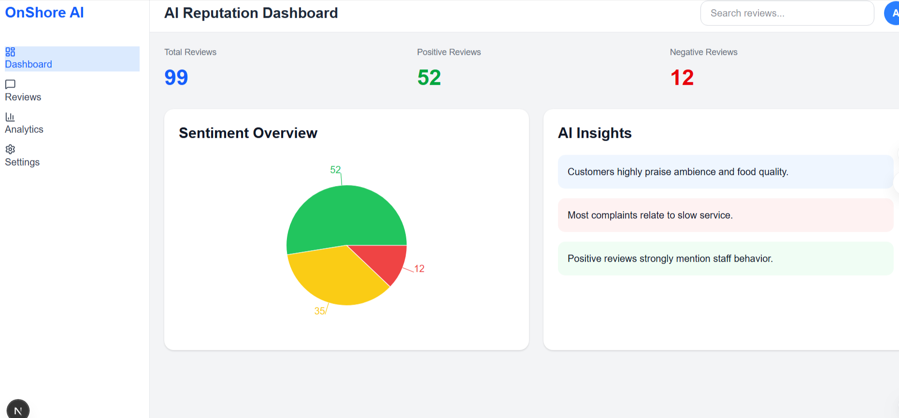
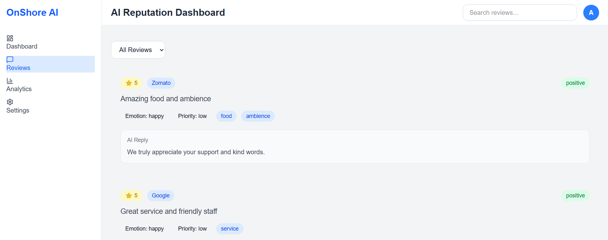
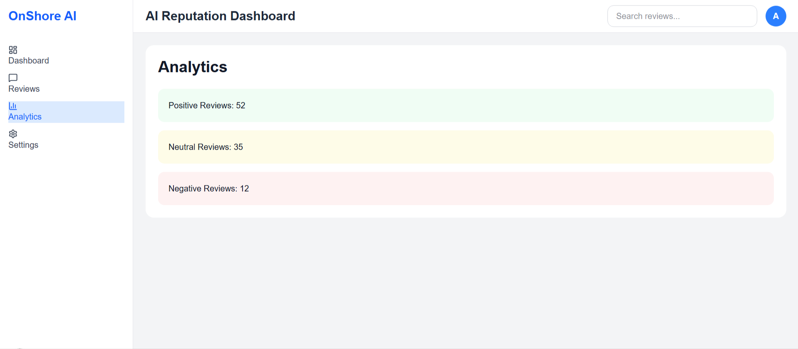

# AI-Powered Reputation Management Dashboard

## Overview

The AI-Powered Reputation Management Dashboard is a full-stack web application designed for restaurants and hospitality businesses to monitor and analyze customer reviews from multiple platforms.

The system aggregates customer feedback, performs sentiment analysis, generates AI-style replies, extracts business insights, and highlights urgent reviews requiring attention.

This project was built as a product-style MVP inspired by real-world Online Reputation Management (ORM) platforms.

---

# Features

## Review Aggregation

* Aggregates mock reviews from multiple platforms
* Simulates review sources like:

  * Google
  * Zomato
  * TripAdvisor

## Sentiment Analysis

* Dynamically classifies reviews into:

  * Positive
  * Neutral
  * Negative

## AI Reply Generation

* Automatically generates professional AI-style responses for customer reviews.

## Emotion Detection

* Detects customer emotion:

  * Happy
  * Neutral
  * Frustrated

## Priority Detection

* Marks reviews as:

  * Low
  * Medium
  * High priority

## Topic Extraction

* Extracts important business topics:

  * Food
  * Service
  * Ambience

## Analytics Dashboard

* Total review metrics
* Positive review count
* Negative review count
* Pie chart visualization
* AI insights section

## Smart Search & Filtering

* Search reviews instantly
* Filter reviews by sentiment

## Sidebar Navigation

* Dashboard
* Reviews
* Analytics
* Settings

---

# Tech Stack

## Frontend

* Next.js
* Tailwind CSS
* Recharts

## Backend

* FastAPI
* Python

## Data

* JSON mock dataset

---

# Folder Structure

```txt
reputation-dashboard/
│
├── app/
│   ├── components/
│   ├── dashboard/
│   ├── globals.css
│   ├── layout.jsx
│   └── page.jsx
│
├── backend/
│   └── main.py
│
├── data/
│   └── reviews.json
│
├── screenshots/
│
├── README.md
└── package.json
```

---

# System Architecture

```txt
Next.js Frontend
        ↓
FastAPI Backend
        ↓
Review Processing Engine
        ↓
Sentiment Analysis
        ↓
AI Reply Generator
        ↓
Insights & Analytics
```

---

# Installation & Setup

## Clone Repository

```bash
git clone <your-repo-url>
```

## Install Frontend Dependencies

```bash
npm install
```

## Install Backend Dependencies

```bash
pip install fastapi uvicorn
```

---

# Run Backend

Open terminal inside backend folder:

```bash
uvicorn main:app --reload
```

Backend runs on:

```txt
http://127.0.0.1:8000
```

---

# Run Frontend

Open terminal in project root:

```bash
npm run dev
```

Frontend runs on:

```txt
http://localhost:3000
```

---

# Backend APIs

## Root API

```txt
/
```

## Reviews API

```txt
/reviews
```

Returns:

* Sentiment
* Emotion
* Priority
* Topics
* AI replies

---

# Screenshots

## Dashboard



---

## Reviews Page



---

## Analytics


---

## Sentiment Pie Chart



---

# Current Functionality

* Mock review aggregation
* Dynamic sentiment analysis
* AI-style review replies
* Emotion analysis
* Topic extraction
* Analytics dashboard
* Search & filtering
* Sidebar navigation

---

# Future Improvements

* Real Google Reviews integration
* OpenAI/Gemini API integration
* Authentication system
* Database integration
* Export reports
* Multi-business support
* Dark mode
* Real-time analytics

---

# Notes

* This project currently uses mock review data stored in JSON format.
* The sentiment analysis is keyword-based for lightweight performance and MVP simplicity.
* The architecture is modular and can support advanced NLP models in production.

---

# Author

Aditya Dhotre
